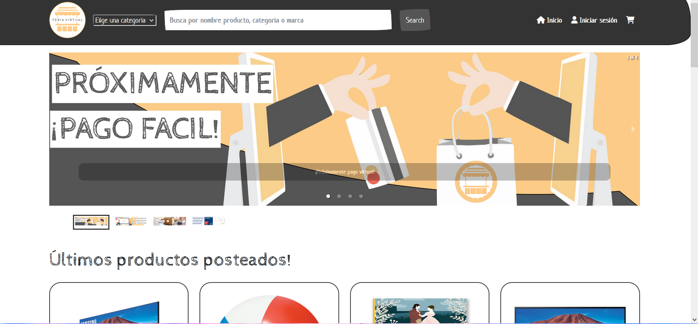
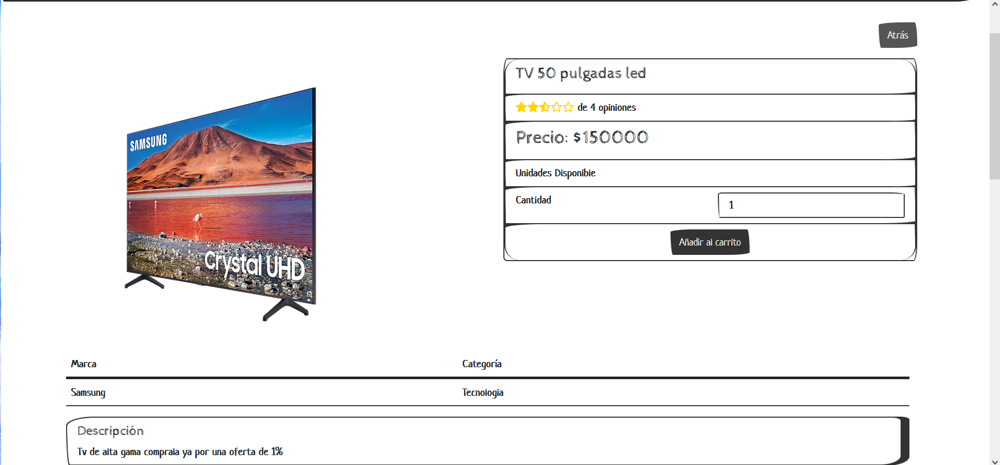

# feria-virtual-projectv2
Proyecto grupal Coding Dojo 2022 

Página e-commerce sobre una feria virtual. Se quiso recrear ferias de las calles en una página web.


Imagen 1:


Imagen 2:


Imagen 3: 



## Como correr?

-   [ ]  En la base del proyecto crea un archivo .env con los siguiente:

```
NODE_ENV = development
PORT = 8000
MONGO_URI = (Link de la db que debes crear en MongoAtlas)
JWT_SECRET = abc123
PAYPAL_CLIENT_ID = (ID que se consigue en el sandbox de PayPal => https://developer.paypal.com/home)

```
-   [ ]  En la carpeta base correspondiente al servidor corre:

```
npm i 
```

-   [ ] Luego ingresa a la carpeta cliente y corre
```
npm i
```

-   [ ] Iniciar el servidor con

```
nodemon server.js
```

-   [ ]  Iniciar el cliente desde su carpeta
```
npm run start 
``` 
